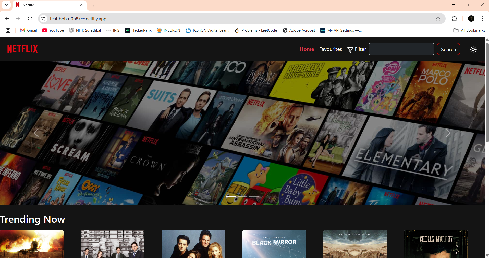
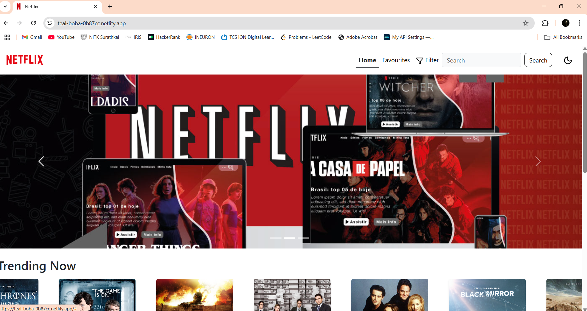

# Netflix Clone 

## Project Description
A responsive Netflix clone built with **React** using locally stored movie data. This project replicates Netflix's core UI/UX with additional features like theme toggling and favorites management.

### Key Features: 
- **Local Movie Database**  
  - Movie details and posters stored locally (no API needed).  
- **Advanced Filtering**  
  - Filter movies by **genre** or **search by name**.  
- **Theme Toggle**   
  - Switch between **light** and **dark** mode.  
- **Favorites System**   
  - Add/remove movies from your favorites section.  
- **Responsive Design**  
  - Works on all devices (desktop, tablet, mobile).

### Why This Project?  
- No external API dependencies.  
- Custom features beyond the original Netflix UI.  
- Ideal for portfolios (demonstrates React skills + UI/UX design).
### Live Demo  
Project link deployed on the Netlify [Netflix Clone Demo](https://teal-boba-0b87cc.netlify.app/)

## Prerequisites

Before running the project, ensure you have these installed:

| Requirement       | Installation Guide | Verification Command |
|-------------------|--------------------|----------------------|
| **Node.js** (v16+) | [Download Node.js](https://nodejs.org/) | `node -v` |
| **npm** (v8+) or **Yarn** | Comes with Node.js<br>or `npm install -g yarn` | `npm -v` or `yarn -v` |
| **Git** | [Install Git](https://git-scm.com/) | `git --version` |

### System Requirements
- **RAM**: Minimum 4GB (8GB recommended)
- **Disk Space**: 500MB+ free space
- **OS**: Windows/macOS/Linux (64-bit)

## **Tools & Technologies Used**

| Category          | Technologies |
|-------------------|-------------|
| **Frontend**      |    |
| **State Management** |  |
| **Icons**         |   |
| **Deployment**    |  |
| **Version Control** |   |
| **Code Editor**   |  

## Code Structure
```
src/
│
├── api/ 
│ └── tmdb.js #functions to fetch movies from local storage
│
├── assets/ # Static assets (logos, images)
├── components/
│ ├── DialogBox.jsx # Modal/popup component
│ ├── Footer.jsx # Page footer
│ ├── GenreMovies.jsx # Genre-specific movie listings
│ ├── HeroBanner.jsx # Main featured content banner
│ ├── MovieCard.jsx # Individual movie thumbnail
│ ├── MovieDetails.jsx # Expanded movie information
│ ├── MovieRow.jsx # Horizontal movie list
│ ├── NavBar.jsx # Navigation header
│ └── SearchResult.jsx # Search results display
│
├── context/ # React context
│ └── ThemeContext.jsx # Theme management
│
├── data/ # Local database
│ └── movies.json # Movie dataset
│
├── pages/ # Route-level components
│ ├── Favorites.jsx # Favorites page
│ └── Home.jsx # Main browse page
│
├── App.jsx # Root component
└── main.jsx # Application entry point
```

## Coding Standards & Best Practices

### Component Design
- All components are built as functional components using React hooks
- Follow the Single Responsibility Principle (one primary function per component)
- Reuse components like `MovieCard` across different views
- Use descriptive component names (`MovieDetails`, `GenreMovies`, etc.)

### State Management
- `useState` for local component state management
- Context API for global theme management
- `localStorage` for persisting user favorites
- Always clean up effects and subscriptions

### Props Handling
- Validate all props using PropTypes
- Provide default props for optional values
- Use consistent prop naming conventions (e.g., always use `show` for show/movie data)
- Destructure props at the component declaration

### Performance
- Implement cleanup functions in `useEffect`
- Use conditional rendering to avoid unnecessary DOM elements
- Memoize expensive calculations when needed
- Implement lazy loading for route components

### Styling Approach
1. **Bootstrap utilities** as primary styling method
2. **CSS modules** for component-specific styles
3. **Inline styles** only for dynamic values
4. **Responsive design** using Bootstrap's grid system

### Error Handling
- Use optional chaining (`?.`) for safe property access
- Provide fallback UI for missing data
- Wrap localStorage operations in try-catch blocks
- Show user-friendly error messages

### Code Organization
- Group related files by feature
- Use PascalCase for component files (e.g., `MovieDetails.jsx`)
- Use camelCase for helper files and utilities
- Keep component files under 300 lines of code


## Screenshots
### Home Page in Dark Mode

### Home Page in Light Mode 

