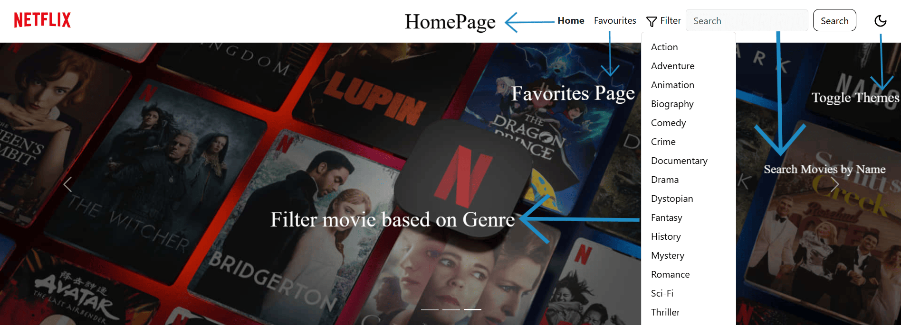
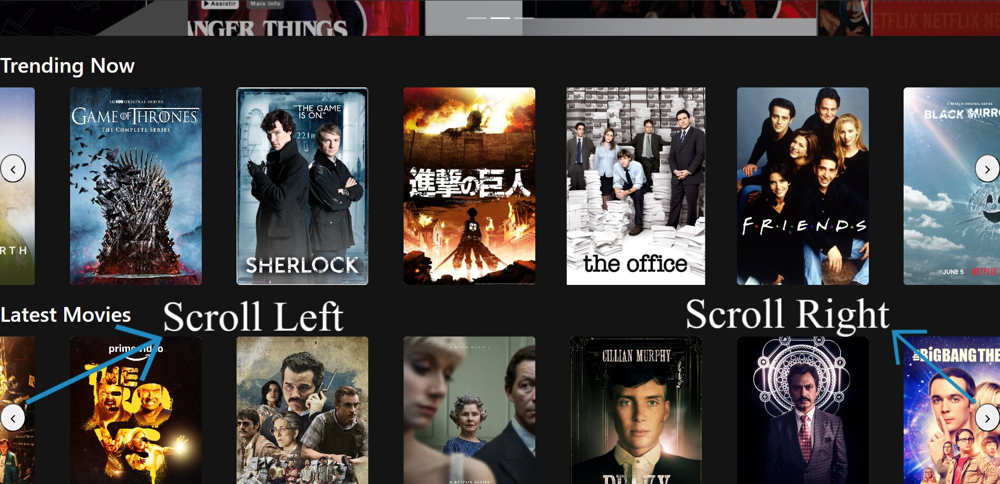
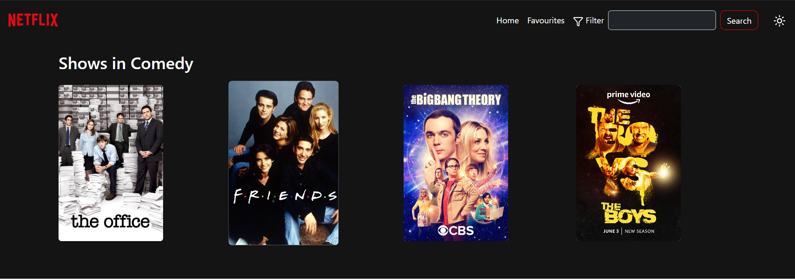
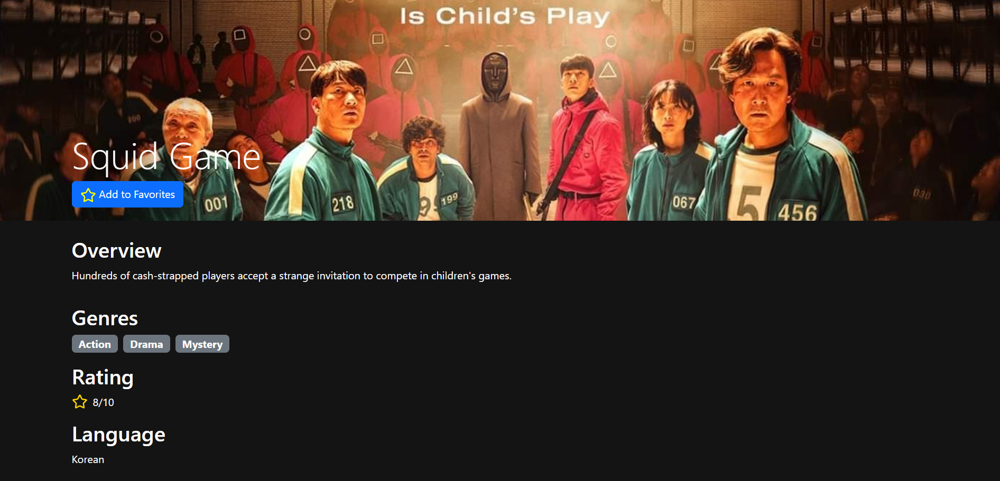
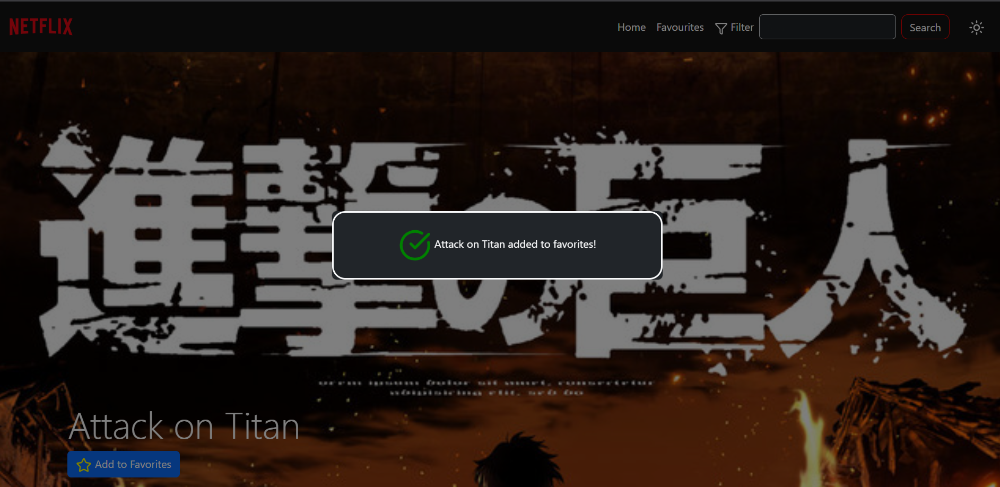
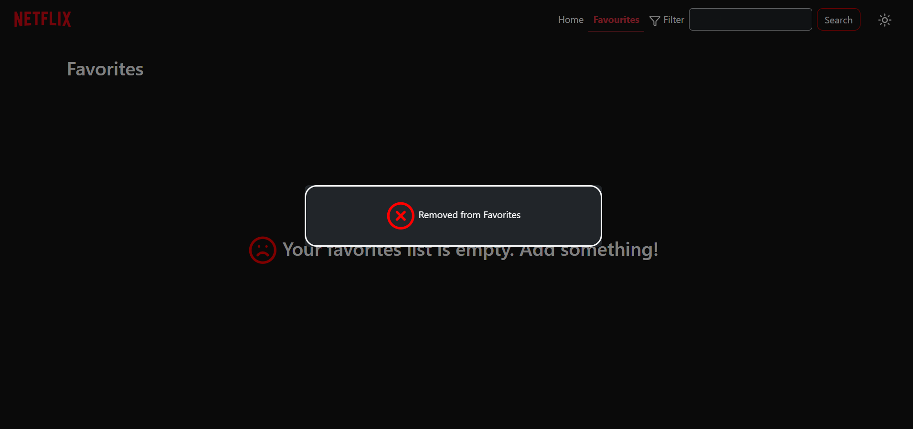

# Netflix Clone 

## Project Description
A responsive Netflix clone built with **React** using locally stored movie data. This project replicates Netflix's core UI/UX with additional features like theme toggling and favorites management.

### Key Features: 
- **Local Movie Database**  
  - Movie details and posters stored locally (no API needed).  
- **Advanced Filtering**  
  - Filter movies by **genre** or **search by name**.  
- **Theme Toggle**   
  - Switch between **light** and **dark** mode.  
- **Favorites System**   
  - Add/remove movies from your favorites section.  
- **Responsive Design**  
  - Works on all devices (desktop, tablet, mobile).

### Why This Project?  
- No external API dependencies.  
- Custom features beyond the original Netflix UI.  
- Ideal for portfolios (demonstrates React skills + UI/UX design).
### Live Demo  
Project link deployed on the Netlify [Netflix Clone Demo](https://teal-boba-0b87cc.netlify.app/)

## Prerequisites

Before running the project, ensure you have these installed:

| Requirement       | Installation Guide | Verification Command |
|-------------------|--------------------|----------------------|
| **Node.js** (v16+) | [Download Node.js](https://nodejs.org/) | `node -v` |
| **npm** (v8+) or **Yarn** | Comes with Node.js<br>or `npm install -g yarn` | `npm -v` or `yarn -v` |
| **Git** | [Install Git](https://git-scm.com/) | `git --version` |

### System Requirements
- **RAM**: Minimum 4GB (8GB recommended)
- **Disk Space**: 500MB+ free space
- **OS**: Windows/macOS/Linux (64-bit)

## **Tools & Technologies Used**

| Category          | Technologies |
|-------------------|-------------|
| **Frontend**      |    |
| **State Management** |  |
| **Icons**         |   |
| **Deployment**    |  |
| **Version Control** |   |
| **Code Editor**   |  

## Code Structure
```
src/
│
├── api/ 
│ └── tmdb.js #functions to fetch movies from local storage
│
├── assets/ # Static assets (logos, images)
├── components/
│ ├── DialogBox.jsx # Modal/popup component
│ ├── Footer.jsx # Page footer
│ ├── GenreMovies.jsx # Genre-specific movie listings
│ ├── HeroBanner.jsx # Main featured content banner
│ ├── MovieCard.jsx # Individual movie thumbnail
│ ├── MovieDetails.jsx # Expanded movie information
│ ├── MovieRow.jsx # Horizontal movie list
│ ├── NavBar.jsx # Navigation header
│ └── SearchResult.jsx # Search results display
│
├── test/ 
│   ├── SearchResult.test.jsx
│   └── MovieDetails.test.jsx
├── context/ # React context
│ └── ThemeContext.jsx # Theme management
│
├── data/ # Local database
│ └── movies.js # Movie dataset
│
├── pages/ # Route-level components
│ ├── Favorites.jsx # Favorites page
│ └── Home.jsx # Main browse page
│
├── App.jsx # Root component
└── main.jsx # Application entry point
```

## Coding Standards & Best Practices

### Component Design
- All components are built as functional components using React hooks
- Follow the Single Responsibility Principle (one primary function per component)
- Reuse common components across different views
- Use descriptive and consistent naming conventions for components
- Implement container/presentational pattern where appropriate

### State Management
- Use useState for local component state management
- Use useParam for url fetching
- Leverage Context API for global theme management
- Persist user preferences using localStorage
- Always include cleanup functions for effects and subscriptions
- Keep business logic separate from UI components

### Props Handling
- Validate all props using PropTypes
- Provide sensible default values for optional props
- Maintain consistent prop naming conventions
- Destructure props at the component declaration
- Document expected prop types and shapes

### Performance
- Implement proper cleanup in useEffect hooks
- Use conditional rendering to optimize DOM updates
- Implement code splitting for route components
- Optimize image loading and assets

### Styling Approach
- Primary styling through Bootstrap utility classes
- Component-scoped styles using CSS modules
- Limited inline styles for dynamic values only
- Responsive layouts using Bootstrap's grid system
- Theme-aware styling with CSS variables

### Error Handling
- Use optional chaining for safe property access
- Implement comprehensive fallback UIs
- Handle runtime errors gracefully
- Provide clear user feedback for failures
- Validate data from external sources

### Code Organization
- Group related files by feature/domain
- Follow consistent file naming conventions
- Separate concerns through proper folder structure
- Maintain reasonable file size limits
- Keep related test files colocated

## Error Handling & Debugging Guide

### 1. Common Error Types
#### Frontend Issues
- Blank screens or broken component rendering
- UI not updating when state changes
- Navigation errors or incorrect routes

#### Data Problems
- Favorites list not saving between sessions
- Missing movie posters or details
- Theme preferences resetting unexpectedly

### 2. Debugging Tools
- Chrome/Firefox Developer Tools
- React Component Inspector
- Redux/Zustand State Debugger
- Network Throttling for slow connection testing

### 3. Prevention Strategies
- Strict prop type validation
- Comprehensive error boundaries
- Data sanitization before storage
- Fallback UI components for loading states

### 4. Debugging Checklist
-  Check browser console for errors
-  Verify component props
-  Test state management flow
-  Validate localStorage data
-  Test all user interactions

## UI/UX Guidelines
### Navigation Bar
Provides the Navigation to Home page, Favorites page, Filter by Genre options, Search movie by name and also toggle between themes.

### Home page in light mode 

### Home page in Dark mode 

### Scroll buttons
It helps to scroll the Movies cards right and left.

### Filter Results

### Search Results

### Movie Details Page 

### Dialog Box when Movie Added

### Dialog when Movie Removed


## Testing Strategy

### **1. Renders Movie Details Correctly**
This test verifies the rendering behavior of the `MovieDetails` component under different scenarios:

 #### Correctly renders movie details:
  - Movie name  
  - Summary  
  - Genres  
  - Rating  
  - Language  

#### Handles the loading state:
  - Displays a `Spinner` while loading the movie details  

#### Handles movie not found case:
  - Shows a "Show not found" message if the movie ID does not match any predefined movie  


### **2. Adds Movie to Favorites Correctly**
This test verifies the behavior of the "Add to Favorites" functionality:

- Adds a movie to local storage as a favorite  
- Displays a success message when the movie is added  
- Handles duplicates:
  - Shows an error message if the movie is already in the favorites list  

### 3. **Rendering Search Results Correctly**
- **Purpose:** Ensure that the component renders search results based on a valid search query.
- **Test Steps:**
   - Provide a valid search query.
   - Check if the correct search results are displayed.
   - Verify that the search query is shown in the header.
- **Expected Outcome:** Correct search results should be rendered.

### 4. **Case Insensitivity**
- **Purpose:** Ensure that the search functionality works regardless of the query's case.
- **Test Steps:**
   - Provide a search query with mixed uppercase and lowercase characters.
   - Verify that the search still returns correct results.
- **Expected Outcome:** The search should be case-insensitive and return matching results.

### **Testing Tool:**  
- Performed using **Vitest** for fast and efficient unit testing.  

## Deployment Guide

### 1. Prerequisites
- Node.js (v16 or higher)
- npm or yarn package manager
- Git installed and configured
- Free account with Netlify
### 2. Build Setup
#### Install dependencies:
 - npm install
####  Create production build:
- npm run build
- Find built files in the /dist folder
### 3. Hosting Options
Netlify (Recommended) and drop the dist file manually or upload your project in the Github repository and connect the repository in the netlify.
